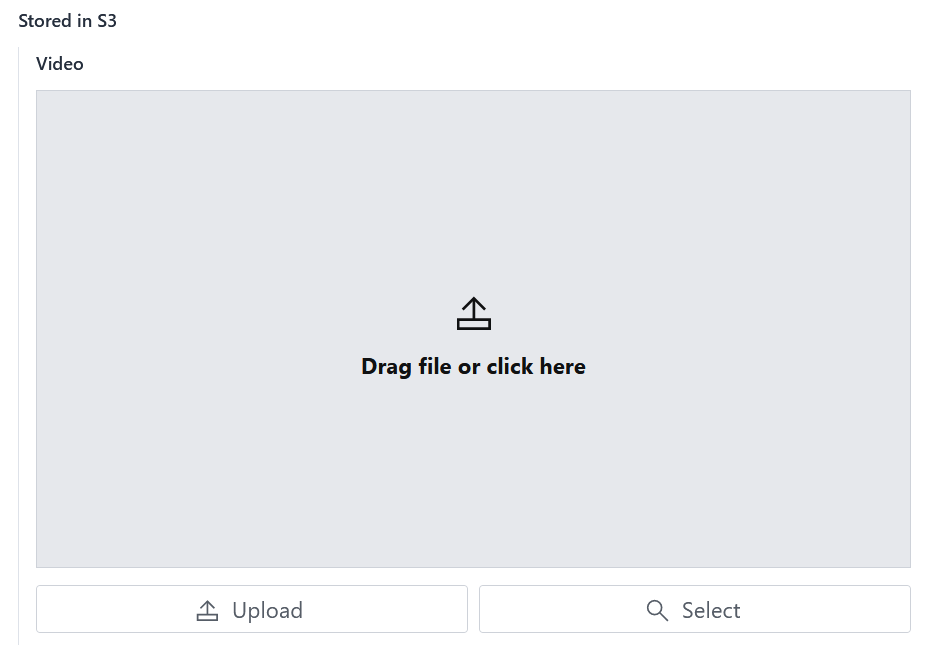
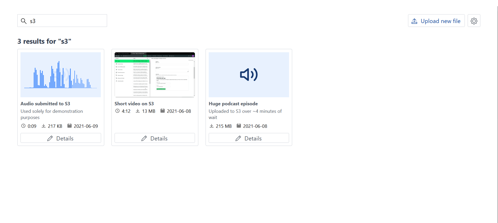
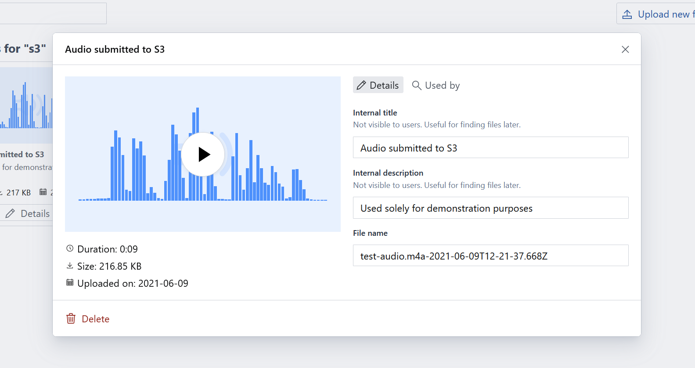
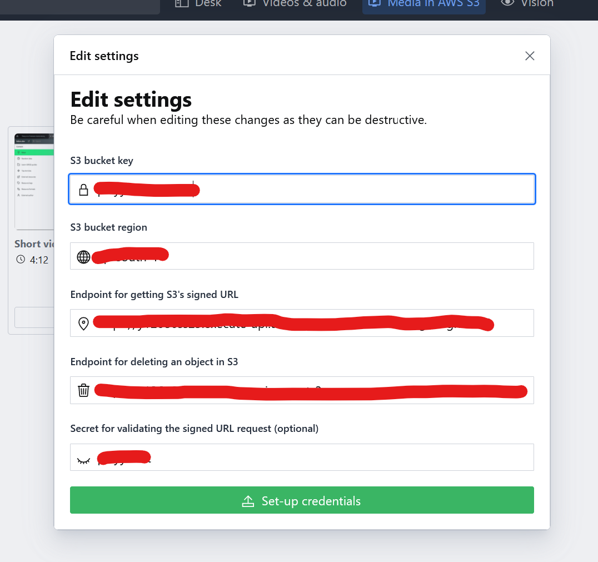

# Firebase Digital Asset Management (DAM) plugin for Sanity.io

Allows uploading, referencing and deleting video and audio files to Firebase directly from your Sanity studio. Is a flavor of [sanity-plugin-external-dam](https://github.com/hdoro/sanity-plugin-external-dam).

**Screenshots:**

## Installing

Start by installing the plugin:

`sanity install firebase-dam`

Add your bucket URL and API key to the plugin via the dedicated settings dialog.

I plan on recording a video tutorial going through the process in detail. Until then, reach out if you have questions 😉

## Contributing, roadmap & acknowledgments

Refer to [sanity-plugin-external-dam](https://github.com/hdoro/sanity-plugin-external-dam) for those :)